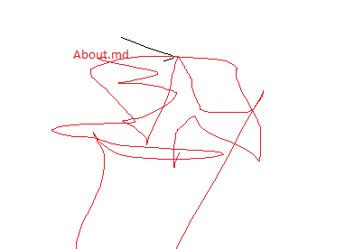
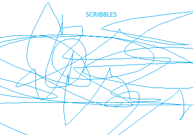

# My Awesome Art Blog
- This `index.md` has the content for the main page that will be seen at the `baseurl`. It will be converted to `index.html`.

- Edit it as you wish.

- Example shows insertion of images.

- This image is at the same level as `index.md`.

- This image is in a subfolder.

